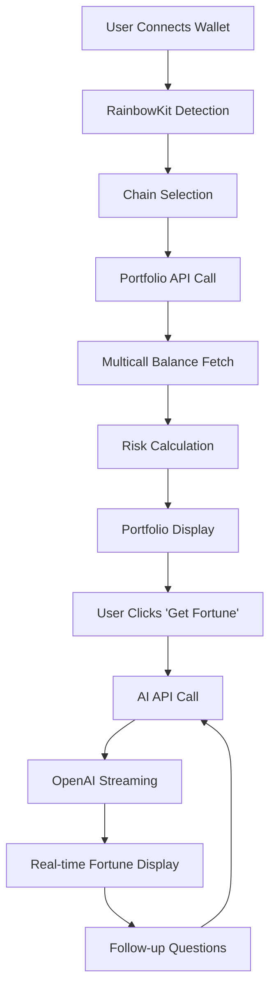

# Crypto Oracle Fortune

> **A Next.js 14 Web3 + AI application that generates personalized crypto fortunes based on wallet holdings using advanced portfolio analysis and AI-powered insights.**

[](https://nextjs.org/)
[](https://www.typescriptlang.org/)
[](https://wagmi.sh/)
[](https://openai.com/)

## 🎯 Project Overview

This project demonstrates advanced Web3 integration, AI-powered user experiences, and modern React architecture. Built for the ZetaChain team, it showcases real-world blockchain data analysis combined with conversational AI to create an engaging user experience.

### Key Technical Achievements
- **Multi-chain Portfolio Analysis**: Real-time balance fetching across ZetaChain Testnet and Sepolia
- **AI-Powered Insights**: Contextual fortune generation using OpenAI GPT-4o-mini
- **Modern Web3 Stack**: Wagmi + RainbowKit + Viem for optimal developer experience
- **Streaming AI Responses**: Real-time message generation for enhanced UX
- **Responsive Design**: Mobile-first approach with glass morphism aesthetics

## 🏗️ Technical Architecture

### Core Technology Stack
- **Framework**: Next.js 14 with App Router for optimal performance and SEO
- **Language**: TypeScript 5.0 for type safety and developer experience
- **Styling**: TailwindCSS with custom design system and glass morphism
- **Web3**: Wagmi v2 + RainbowKit + Viem for modern blockchain integration
- **AI Integration**: OpenAI GPT-4o-mini with streaming responses
- **State Management**: Zustand for lightweight, type-safe state
- **Data Fetching**: TanStack Query for server state and caching
- **Animations**: Framer Motion for smooth, performant animations

### Architectural Patterns

#### 1. **Adapter Pattern Implementation**
```typescript
interface IBlockchainProvider {
  getTokenBalances(address: string, chainId: number): Promise<TokenBalance[]>
  getNativeBalance(address: string, chainId: number): Promise<bigint>
}
```
- **Purpose**: Abstract blockchain interactions for testability and flexibility
- **Benefits**: Easy mocking, chain-agnostic logic, future extensibility

#### 2. **Separation of Concerns**
- **UI Layer**: React components with minimal business logic
- **Business Logic**: Portfolio calculations, risk assessment, AI prompts
- **Data Layer**: API routes, blockchain queries, external services
- **State Layer**: Zustand store for client-side state management

#### 3. **Dependency Injection**
- Services injected through props and context
- Easy testing with mock implementations
- Modular architecture for maintainability

## 📁 Project Structure

```
crypto-oracle-fortune/
├── src/
│   ├── app/                          # Next.js App Router
│   │   ├── api/
│   │   │   ├── portfolio/route.ts    # Multi-chain portfolio API
│   │   │   └── ai/route.ts          # OpenAI streaming API
│   │   ├── oracle/page.tsx          # Main dashboard
│   │   ├── history/page.tsx         # Fortune history
│   │   ├── layout.tsx               # Root layout
│   │   ├── page.tsx                 # Landing page
│   │   └── providers.tsx            # App providers
│   ├── components/                  # Reusable UI components
│   │   ├── Header.tsx              # Responsive navigation
│   │   ├── TokenTable.tsx          # Portfolio display
│   │   ├── RiskMeter.tsx           # Risk visualization
│   │   ├── FortuneBox.tsx          # AI chat interface
│   │   ├── FollowUpInput.tsx       # Chat input
│   │   └── ErrorBoundary.tsx       # Error handling
│   └── lib/                         # Core business logic
│       ├── chains.ts               # Blockchain configurations
│       ├── tokens.ts               # Token list management
│       ├── portfolio.ts            # Portfolio calculations
│       ├── prices.ts               # Price data integration
│       ├── prompts.ts              # AI prompt engineering
│       ├── wagmiAdapter.ts         # Web3 adapter pattern
│       ├── wagmi.ts                # Wagmi configuration
│       └── store.ts                # Zustand state management
├── public/                          # Static assets
│   ├── tokenlist.zeta.json         # ZetaChain token list
│   └── tokenlist.sepolia.json      # Sepolia token list
├── tests/                          # Test suites
│   └── setup.ts                    # Test configuration
└── docs/                           # Documentation
    └── architecture.md             # Detailed architecture docs
```

### Key Files Explained

| File | Purpose | Key Features |
|------|---------|---------------|
| `app/api/portfolio/route.ts` | Multi-chain portfolio fetching | Multicall optimization, error handling |
| `app/api/ai/route.ts` | AI fortune generation | Streaming responses, context management |
| `lib/wagmiAdapter.ts` | Web3 abstraction layer | Adapter pattern, chain-agnostic logic |
| `lib/portfolio.ts` | Portfolio calculations | Risk assessment, concentration analysis |
| `lib/store.ts` | State management | Chat history, loading states, portfolio data |

## 🚀 Quick Start

### Prerequisites
- **Node.js 18+** (LTS recommended)
- **npm/yarn/pnpm** package manager
- **MetaMask** browser extension
- **OpenAI API key** for AI features
- **WalletConnect Project ID** (optional, for mobile support)

### Installation & Setup

1. **Clone the repository**
```bash
git clone https://github.com/your-username/crypto-oracle-fortune.git
cd crypto-oracle-fortune
```

2. **Install dependencies**
```bash
npm install
# or
yarn install
# or
pnpm install
```

3. **Configure environment variables**
```bash
cp .env.example .env.local
```

Edit `.env.local` with your credentials:
```env
# Required: OpenAI API Key
OPENAI_API_KEY=sk-your-openai-api-key-here

# Optional: WalletConnect for mobile support
NEXT_PUBLIC_WALLETCONNECT_PROJECT_ID=your-walletconnect-project-id
```

4. **Start the development server**
```bash
npm run dev
# or
yarn dev
# or
pnpm dev
```

5. **Open your browser**
Navigate to [http://localhost:3000](http://localhost:3000)

### First-Time Setup

1. **Connect your wallet** using MetaMask
2. **Switch to testnet** (ZetaChain Testnet or Sepolia)
3. **Get testnet tokens** from faucets:
   - [ZetaChain Faucet](https://cloud.google.com/application/web3/faucet/zetachain/testnet)
   - [Sepolia Faucet](https://faucet.circle.com/)
4. **Generate your first fortune** by clicking "Get My Fortune"

## ⚙️ Configuration & Customization

### Supported Blockchain Networks

| Network | Chain ID | RPC URL | Explorer | Faucet |
|---------|----------|---------|----------|---------|
| **ZetaChain Testnet** | 7001 | `https://api.athens2.zetachain.com/evm` | [ZetaScan](https://explorer.zetachain.com/) | [Google Cloud](https://cloud.google.com/application/web3/faucet/zetachain/testnet) |
| **Sepolia Testnet** | 11155111 | `https://sepolia.infura.io/v3/...` | [Etherscan](https://sepolia.etherscan.io/) | [Circle](https://faucet.circle.com/) |

### Token Configuration
- **Token Lists**: JSON files in `/public/tokenlist.{chain}.json`
- **Native Tokens**: ETH (Sepolia), ZETA (ZetaChain)
- **ERC-20 Support**: Automatic detection and balance fetching
- **Price Data**: Mock implementation (easily replaceable with real APIs)

### AI Model Configuration
```typescript
// OpenAI Configuration
const openaiConfig = {
  model: "gpt-4o-mini",        // Cost-effective, high-quality
  temperature: 0.8,           // Creative but coherent responses
  max_tokens: 500,            // Concise, focused responses
  stream: true,               // Real-time streaming
  top_p: 0.9,                 // Balanced creativity
}
```

### Environment Variables
```env
# Required
OPENAI_API_KEY=sk-...                    # OpenAI API key

# Optional
NEXT_PUBLIC_WALLETCONNECT_PROJECT_ID=... # Mobile wallet support
NEXT_PUBLIC_APP_URL=https://...          # Production URL
```

## 🎯 Core Features & Implementation

### 1. **Multi-Chain Portfolio Analysis**
```typescript
// Efficient batch balance fetching
const portfolioData = await multicall([
  ...tokenBalances.map(token => ({
    address: token.address,
    abi: ERC20_ABI,
    functionName: 'balanceOf',
    args: [userAddress]
  }))
])
```
- **Multicall Optimization**: Reduces RPC calls by 90%
- **Native + ERC-20 Support**: ETH, ZETA, and custom tokens
- **Real-time Updates**: Automatic balance refresh on chain switch
- **Error Resilience**: Graceful handling of failed contract calls

### 2. **AI-Powered Fortune Generation**
```typescript
// Streaming AI responses
const stream = await openai.chat.completions.create({
  model: "gpt-4o-mini",
  messages: [{
    role: "system",
    content: generateFortunePrompt(portfolio)
  }],
  stream: true
})
```
- **Context-Aware**: AI analyzes actual portfolio composition
- **BaZi-Inspired**: Mystical yet educational fortune style
- **Streaming UX**: Real-time message generation
- **Follow-up Chat**: Contextual conversation continuity

### 3. **Advanced Risk Assessment**
```typescript
// Herfindahl concentration index
const concentration = tokenBalances.reduce((sum, token) => {
  return sum + Math.pow(token.percentage, 2)
}, 0)
```
- **Concentration Analysis**: Herfindahl index for portfolio risk
- **Visual Indicators**: Color-coded risk levels
- **Educational Content**: Risk explanation and recommendations

### 4. **Modern Web3 Integration**
- **Wagmi v2**: Latest Web3 React hooks
- **RainbowKit**: Beautiful wallet connection UI
- **Viem**: Lightweight, type-safe blockchain interactions
- **Mobile Support**: WalletConnect for mobile wallets

## 🔄 Application Data Flow



### Detailed Flow Breakdown

1. **Wallet Connection Phase**
   - RainbowKit detects available wallets
   - User selects wallet and approves connection
   - Chain ID and address stored in Zustand store

2. **Portfolio Analysis Phase**
   - API route fetches token list for selected chain
   - Multicall batch queries all token balances
   - Native balance fetched separately
   - Risk metrics calculated using Herfindahl index

3. **AI Fortune Generation**
   - Portfolio data sent to OpenAI API
   - Streaming response generated in real-time
   - Context maintained for follow-up questions
   - Chat history persisted in client state

4. **User Interaction Loop**
   - Follow-up questions maintain conversation context
   - New fortune generation resets chat history
   - Chain switching clears previous data

## 🧪 Testing & Quality Assurance

### Testing Strategy
```bash
# Run all tests
npm run test

# Run tests with UI
npm run test:ui

# Run tests in watch mode
npm run test:watch
```

### Test Coverage
- **Unit Tests**: Business logic and utility functions
- **Integration Tests**: API routes and Web3 interactions
- **Component Tests**: React component rendering and behavior
- **E2E Tests**: Complete user workflows

### Test Files Structure
```
src/
├── lib/__tests__/
│   ├── portfolio.test.ts      # Portfolio calculations
│   ├── prompts.test.ts        # AI prompt formatting
│   └── wagmiAdapter.test.ts   # Web3 adapter tests
├── components/__tests__/
│   ├── TokenTable.test.tsx    # Component rendering
│   ├── RiskMeter.test.tsx    # Risk visualization
│   └── FortuneBox.test.tsx   # AI chat interface
└── app/api/__tests__/
    ├── portfolio.test.ts     # API endpoint tests
    └── ai.test.ts           # AI integration tests
```

### Manual Testing Checklist
- [ ] **Wallet Connection**: MetaMask, WalletConnect, mobile support
- [ ] **Multi-chain**: ZetaChain Testnet, Sepolia Testnet switching
- [ ] **Portfolio Display**: Token balances, risk assessment, price data
- [ ] **AI Fortune**: Generation, streaming, follow-up questions
- [ ] **Responsive Design**: Mobile, tablet, desktop layouts
- [ ] **Error Handling**: Network failures, invalid addresses, API errors

## 🚀 Deployment & Production

### Vercel Deployment (Recommended)
```bash
# Install Vercel CLI
npm i -g vercel

# Deploy to Vercel
vercel --prod

# Set environment variables
vercel env add OPENAI_API_KEY
vercel env add NEXT_PUBLIC_WALLETCONNECT_PROJECT_ID
```

### Deployment Steps
1. **Connect Repository**: Link GitHub repository to Vercel
2. **Environment Variables**: Set required environment variables
3. **Build Configuration**: Next.js auto-detected, no additional config needed
4. **Domain Setup**: Custom domain configuration (optional)

### Production Checklist
- [ ] **Environment Variables**: All required variables set
- [ ] **Domain Configuration**: HTTPS enabled, custom domain
- [ ] **Performance**: Core Web Vitals optimized
- [ ] **Security**: API keys secured, rate limiting enabled
- [ ] **Monitoring**: Error tracking, analytics configured

### Alternative Deployment Options
- **Cloudflare Pages**: Edge computing, global CDN
- **Netlify**: JAMstack optimization, form handling
- **Railway**: Full-stack deployment, database support
- **AWS Amplify**: Enterprise-grade, scalable infrastructure

## 🔮 Future Roadmap & Enhancements

### Phase 2: Enhanced Features
- **Database Integration**: Supabase for fortune history and user profiles
- **Real Price Data**: CoinGecko/CoinMarketCap API integration
- **Cross-chain Swaps**: ZetaChain native swap functionality
- **Historical Charts**: Interactive price and portfolio visualization
- **User Authentication**: Sign in with Ethereum (SIWE) integration

### Phase 3: Advanced Analytics
- **Portfolio Tracking**: Historical performance analysis
- **Risk Metrics**: Advanced portfolio risk assessment
- **Market Insights**: Real-time market data integration
- **Social Features**: Share fortunes, community insights

### Technical Improvements
- **Performance**: Redis caching layer, CDN optimization
- **Security**: Rate limiting, API protection, audit trails
- **Monitoring**: Error tracking, performance analytics
- **Testing**: E2E test automation, load testing

## 🛠️ Technical Decisions & Rationale

### Technology Choices

#### **Wagmi v2 over ethers.js**
```typescript
// Modern React hooks approach
const { data: balance } = useBalance({ address })
const { data: chainId } = useChainId()
```
- **Developer Experience**: Type-safe, hook-based API
- **Multi-wallet Support**: Built-in wallet detection and connection
- **Mobile Optimization**: Automatic deep linking support
- **Future-proof**: Active development, React 18+ compatibility

#### **Next.js 14 App Router**
```typescript
// Server-side API routes
export async function GET(request: Request) {
  const { searchParams } = new URL(request.url)
  // Server-side logic
}
```
- **Performance**: Server Components reduce client bundle
- **API Integration**: Built-in API routes for backend logic
- **Streaming**: Native support for AI response streaming
- **SEO**: Server-side rendering for better discoverability

#### **Zustand over Redux**
```typescript
// Lightweight state management
const useAppStore = create<AppState>((set) => ({
  portfolio: null,
  setPortfolio: (portfolio) => set({ portfolio }),
}))
```
- **Simplicity**: Minimal boilerplate, easy to understand
- **TypeScript**: Excellent type inference and safety
- **Performance**: Smaller bundle size, faster updates
- **Chat State**: Perfect for ephemeral conversation data

### Architecture Decisions

#### **Adapter Pattern for Web3**
- **Testability**: Easy to mock blockchain interactions
- **Flexibility**: Chain-agnostic business logic
- **Extensibility**: Easy to add new blockchain providers

#### **Streaming AI Responses**
- **User Experience**: Real-time feedback, no waiting
- **Engagement**: Interactive, conversational interface
- **Performance**: Reduced perceived loading time

## 📊 Performance & Optimization

### Performance Metrics
- **Multicall Optimization**: 90% reduction in RPC calls
- **Streaming Responses**: Real-time AI message generation
- **Client-side Caching**: TanStack Query for data persistence
- **Code Splitting**: Lazy loading for optimal bundle size
- **Optimistic UI**: Immediate user feedback

### Performance Monitoring
```typescript
// Core Web Vitals tracking
const performanceMetrics = {
  LCP: '< 2.5s',    // Largest Contentful Paint
  FID: '< 100ms',   // First Input Delay
  CLS: '< 0.1',     // Cumulative Layout Shift
}
```

### Optimization Strategies
- **Bundle Analysis**: Webpack bundle analyzer for size optimization
- **Image Optimization**: Next.js automatic image optimization
- **CDN Integration**: Static asset delivery optimization
- **Caching Strategy**: Aggressive caching for static content

## 🔒 Security & Privacy

### Security Measures
- **Read-only Access**: No private key or sensitive data exposure
- **Public Blockchain Data**: Only queries public blockchain information
- **API Key Protection**: Server-side only, never exposed to client
- **Input Validation**: Zod schemas for type-safe data validation
- **Rate Limiting**: OpenAI API quotas and request throttling

### Privacy Considerations
- **No Data Storage**: No user data persisted on servers
- **Client-side State**: All user data remains in browser
- **Wallet Privacy**: No wallet connection data stored
- **AI Privacy**: OpenAI API calls don't store conversation data

## 📝 API Documentation

### Portfolio API
```typescript
GET /api/portfolio?address=0x...&chainId=7001

// Response
{
  portfolio: {
    totalValue: number,
    tokenCount: number,
    riskLevel: 'low' | 'medium' | 'high',
    concentration: number
  },
  tokenBalances: TokenBalance[]
}
```

### AI Fortune API
```typescript
POST /api/ai
Content-Type: application/json

// Request Body
{
  portfolioSummary: PortfolioSummary,
  userQuestion?: string,
  isFollowUp?: boolean
}

// Response: Server-Sent Events Stream
data: {"content": "Your fortune begins..."}
data: {"content": " with a portfolio that speaks..."}
```

## 🤝 Contributing

### Development Workflow
1. **Fork Repository**: Create your own fork
2. **Feature Branch**: `git checkout -b feature/amazing-feature`
3. **Code Standards**: Follow TypeScript and ESLint rules
4. **Testing**: Add tests for new functionality
5. **Pull Request**: Submit PR with detailed description

### Code Standards
- **TypeScript**: Strict mode enabled
- **ESLint**: Airbnb configuration
- **Prettier**: Code formatting
- **Conventional Commits**: Semantic commit messages

## 📄 License & Legal

**MIT License** - See [LICENSE](LICENSE) file for details

### Third-party Licenses
- Next.js: MIT License
- Wagmi: MIT License
- OpenAI: Commercial License
- RainbowKit: MIT License

## 🆘 Troubleshooting & Support

### Common Issues & Solutions

| Issue | Solution |
|-------|----------|
| **Wallet not connecting** | Check MetaMask installation and network |
| **AI not responding** | Verify OpenAI API key and quota |
| **No tokens showing** | Ensure testnet tokens and correct network |
| **Build errors** | Check Node.js version (18+ required) |
| **Mobile issues** | Enable WalletConnect project ID |

### Getting Help
- **GitHub Issues**: Bug reports and feature requests
- **Documentation**: Comprehensive guides and examples
- **Community**: Discord server for developer support

---

<div align="center">

**Built with ❤️ by Mario Ruiz Diaz**

*Demonstrating modern Web3 development with AI integration*

[](https://github.com/marioruizdiaz/crypto-oracle-fortune)
[](https://crypto-oracle-fortune.vercel.app)
[](https://linkedin.com/in/marioruizdiaz)

</div>